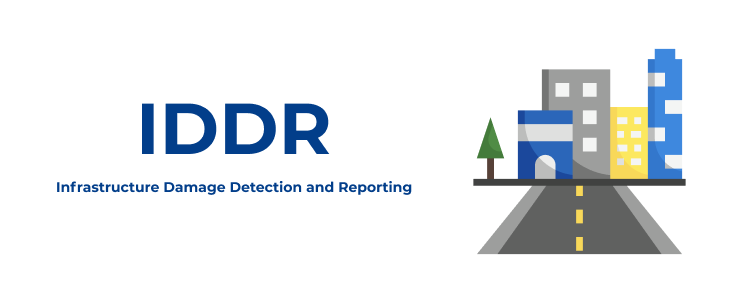
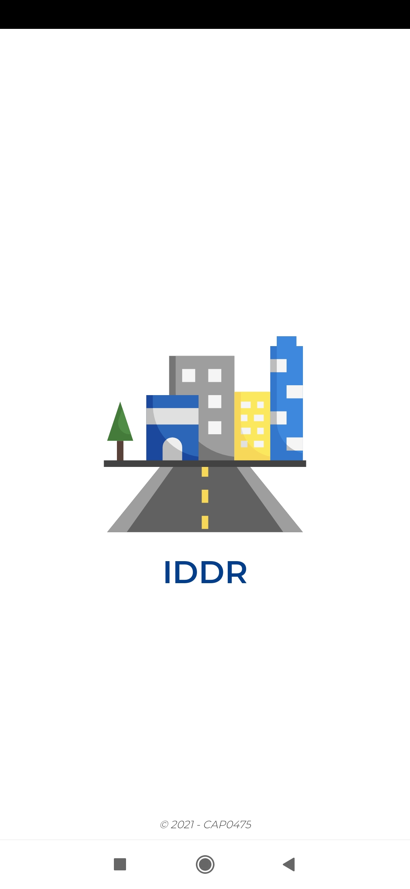
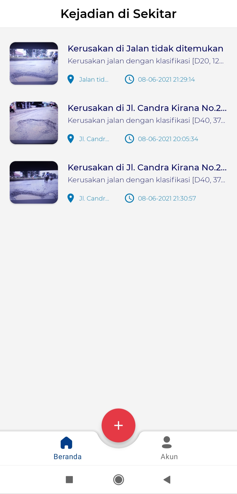
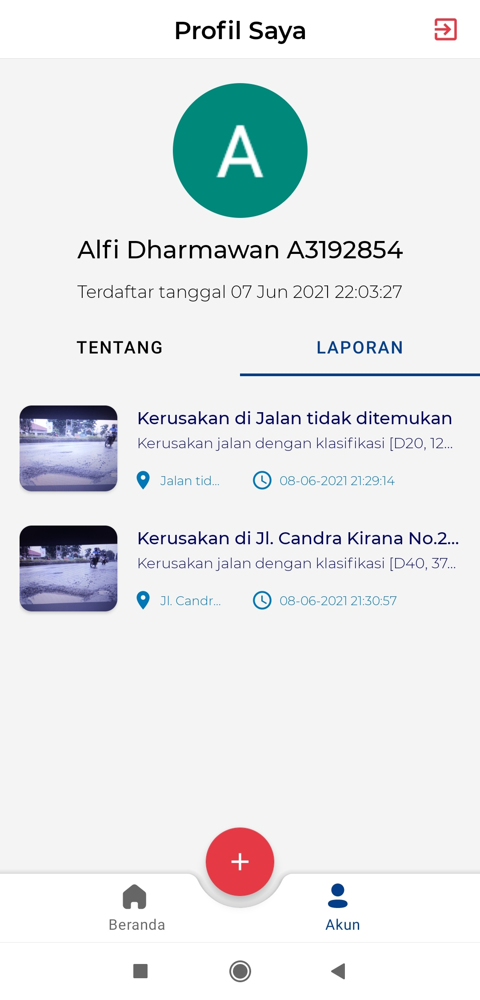
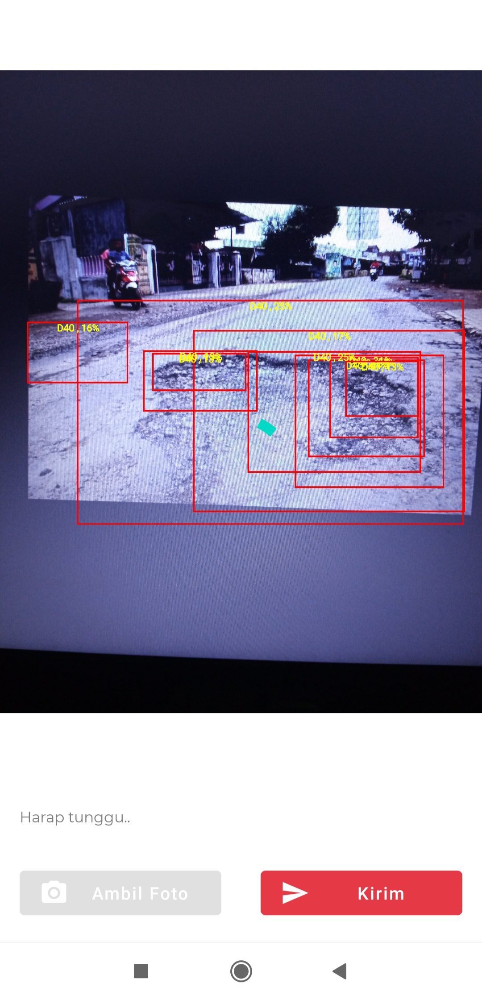
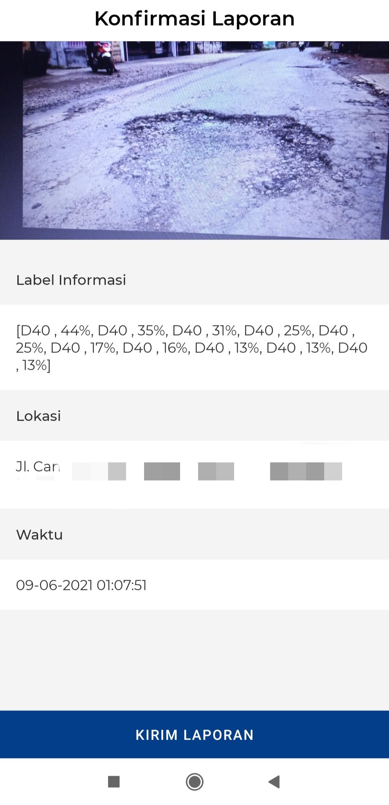

 

  
  
  

    
    
  

  
  <h1 align="center">IDDR Project</h1>

  

    Your on-the-go solution for your on-the-road problem
  

    
# What is IDDR?

According to Badan Pusat Statistik (BPS) in November 2019, it was reported that damaged roads in Indonesia reaches up to 56% of all roads, while healthy roads was only 44%. The Covid-19 pandemic slows down infrastructure activities in Indonesia. Asosiasi Semen Indonesia stated that cement consumption was stunted which shows how infrastructure activities was still being halted at the beginning of 2021

Based on the problem, we come with a solution to detect and report the damages on the road through the help of Machine Learning with our app called IDDR.
IDDR is your on-the-go solution for your on-the-road problem.

## Team
|         Member         | Student ID |        Path          |                                                  Contacts                                                  |
| :--------------------: | :--------: | :----------------:   | :--------------------------------------------------------------------------------------------------------: |
|   Alfi Dharmawan       |  A3192854  |  Mobile Development  |       [![alfi-linkedin][linkedin-shield]][alfi-linkedin-url]&nbsp;[![alfi-github][github-shield]][alfi-github-url]     |
|   Dheja Daruna Panjalu |  C0080914  |  Cloud Computing     |             [![dheja-linkedin][linkedin-shield]][dheja-linkedin-url]&nbsp;[![dheja-github][github-shield]][dheja-github-url]     |
|  Gugi Asgaruning       |  M3142811  | Machine Learning     |      [![gugi-linkedin][linkedin-shield]][gugi-linkedin-url]&nbsp;[![gugi-github][github-shield]][gugi-github-url] |
|     Leon Davin         |  M0080916  |  Machine Learning    |   [![leon-linkedin][linkedin-shield]][leon-linkedin-url]&nbsp;[![leon-github][github-shield]][leon-github-url] |

## Product

- [IDDR Apps.apk](https://s.id/iddrApp) (34 Mb)

### Prerequisites

- Android 5.0 Lolipop or newest is fine
- Internet Connection
- Location Services
- Google Account (app requires sign in with google account)

### Screenshots
 

  </img>&nbsp; &nbsp;&nbsp; &nbsp;&nbsp; &nbsp;&nbsp; &nbsp;&nbsp; &nbsp;

  
## Features

- Object detection with offline mode
- View other's report
- Realtime report data (send & receive)
- View user details & data reported by the user

## Tech Stack

**Machine Learning:** TensorFlow, Object Detection API, TensorFlow Lite

**Android:** Kotlin, XML, FirebaseUI Firestore, Firebase Auth

**Cloud:** Cloud IAM, Firestore, Cloud Storage

## Acknowledgements

 - [Flaticon (Icon made by surang)](https://www.flaticon.com/authors/surang)
 - [readme.so](https://github.com/octokatherine/readme.so)
 
 

  </img>

  

<!-- MARKDOWN LINKS & IMAGES -->
<!-- https://www.markdownguide.org/basic-syntax/#reference-style-links -->
<!-- LinkedIn Link -->

[linkedin-shield]: https://img.shields.io/badge/LinkedIn-0077B5?style=for-the-badge&logo=linkedin&logoColor=white
[alfi-linkedin-url]: https://www.linkedin.com/in/alfi-dharmawan/
[leon-linkedin-url]: https://www.linkedin.com/in/leon-davin-96280b174/
[gugi-linkedin-url]: https://www.linkedin.com/in/asgaruning/
[dheja-linkedin-url]: https://www.linkedin.com/in/dheja-daruna/

<!-- Github Link -->

[github-shield]: https://img.shields.io/badge/GitHub-100000?style=for-the-badge&logo=github&logoColor=white
[alfi-github-url]: https://github.com/alfidh02
[dheja-github-url]: https://github.com/justdheja
[gugi-github-url]: https://github.com/azgaruning
[leon-github-url]: https://github.com/leondavin
